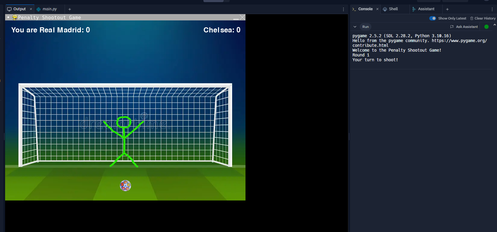
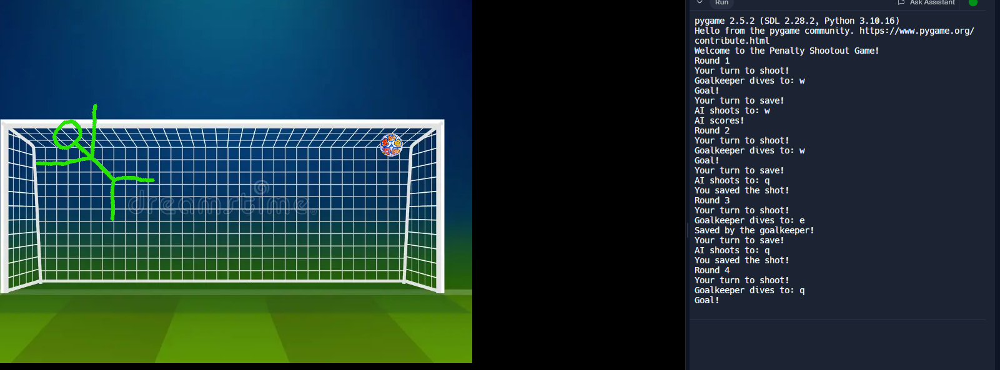

# UEFA Champions League Penalty Shootout Game

A fun and interactive penalty shootout game themed around the UEFA Champions League, featuring Real Madrid and Chelsea.

## Description

This game simulates a penalty shootout where you can both shoot penalties and save them as a goalkeeper. The game features:
- Champions League themed intro videos
- Interactive gameplay with keyboard controls
- Realistic ball and goalkeeper movements
- Score tracking
- Victory/defeat animations

## Prerequisites

- Python 3.10 or higher
- Poetry (Python package manager)

## Installation

1. Clone this repository
2. Install dependencies using Poetry:
```bash
poetry install
```

## Screenshots




## How to Play

1. Run the game:
```bash
poetry run python main.py
```

2. Controls:
   - `Q` - Top left corner
   - `W` - Center
   - `E` - Top right corner
   - `A` - Bottom left corner
   - `D` - Bottom right corner

3. Gameplay:
   - Take turns shooting penalties and saving them
   - Each round consists of one shot and one save
   - Best score after 5 rounds wins
   - If tied after 5 rounds, continues until there's a winner

## Dependencies

- pygame - Game engine
- moviepy - Video playback
- opencv-python - Video processing
- numpy - Mathematical operations
- dearpygui - GUI elements

